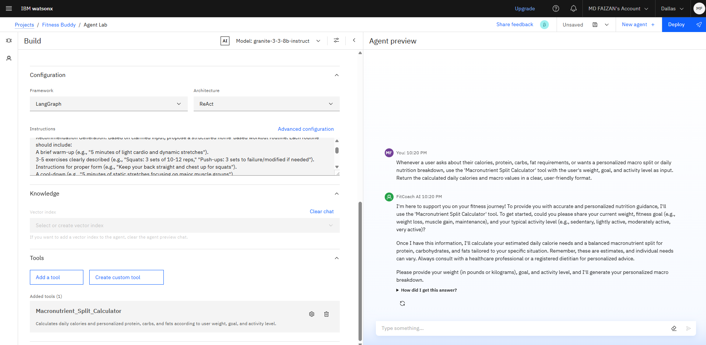

# FitCoach AI

**Your Intelligent Virtual Fitness Coach Powered by IBM watsonx.ai**

---

## Project Overview

FitCoach AI is a conversational AI agent designed to make personalized fitness, nutrition, and wellness guidance accessible to everyone. Built using IBM watsonx.ai and cloud services, this virtual coach listens to your goals and activity levels and offers real-time workout plans, meal ideas, and motivational support. Everything happens through a friendly, easy-to-use chat interface.

With FitCoach AI, you get the motivation and advice of a personal coach, without the need for expensive memberships or complicated apps. Whether you are just starting your fitness journey or are already active, FitCoach AI is always ready to help you take the next step toward a healthier lifestyle.

---

## Key Features

- Personalized workout suggestions and routines tailored to your goals and fitness level  
- Simple and nutritious meal and snack ideas  
- Motivational encouragement and practical habit-building guidance  
- A conversational, supportive experience powered by IBM’s Granite language model  
- Integration with a reliable fitness knowledge base for well-informed responses  
- Calculation tools for personalized nutrition advice  
- No coding or advanced technical skills needed to interact

---

## Technology Stack

- **IBM watsonx.ai Studio & Agent Lab:** Main AI agent creation and flow management  
- **Granite Foundation Model (granite-3-3-8b-instruct)** by IBM (Version 3.3): Natural language understanding and human-like conversation  
- **IBM Cloud Object Storage:** Stores workout routines, nutrition guides, and knowledge resources  
- **Vector Search & Knowledge Grounding:** Fast, accurate retrieval of grounded content and answers  

---

## Macronutrient Split Calculator

The project includes a Python file named `Macronutrient Split Calculator.py` which contains the logic for calculating daily calorie needs and macronutrient distribution based on user input such as weight, fitness goal, and activity level.

This calculator is integrated with the AI agent to provide personalized nutrition recommendations on demand.

---

## How to Use

1. Start chatting with the FitCoach AI agent using the provided interface.  
2. Share your current fitness details like weight, goal (Fat Loss, Maintenance, Muscle Gain), and activity level (Low, Medium, High).  
3. Receive personalized fitness plans, nutrition suggestions, and macro calculations quickly.  
4. Keep coming back for regular encouragement, habit-building advice, and new ideas.

---

## Installation and Setup

FitCoach AI runs mainly on IBM watsonx.ai platform and requires no complex local setup. To explore or contribute to the project locally:

1. Clone this repository:  

        git clone https://github.com/Faiz-3112/FitCoach-AI-Powered-Virtual-Fitness-Coach.git

2. Review the agent configuration, project resources, and the Python script located in `Macronutrient Split Calculator.py`.  
3. Use IBM watsonx.ai Studio and Agent Lab to deploy or customize the agent further.

*Note: The core conversational flows and AI logic are intended to run on IBM watsonx.ai platform.*

---

## Project Structure and Additional Files

- Detailed agent instructions that guide FitCoach AI’s conversational behavior can be found in:  
- `5 agent instructions.txt`  
- The common instructions used for the AI agent are stored in:  
- `6 Common Instructions.txt`  
- Screenshots demonstrating the AI in action are organized in the `Screenshots` folder.  
- The project presentation slides are included as:  
- `FitCoach_AI_Presentation.pptx` (or your PowerPoint file).  
- Macronutrient Split Calculator logic is contained in:  
- `Macronutrient Split Calculator.py`

---

## Screenshots / Demo

Below are some screenshots showcasing interactions with FitCoach AI, giving a glimpse of the user experience and helpful outputs.

  
  

*(Add or replace actual screenshot file names as per your repository)*

---

## Future Enhancements

- Support for multiple languages to reach a global audience  
- Integration with wearable fitness devices for real-time personalized coaching  
- Voice-enabled interaction for hands-free support  
- Social features like community challenges and progress sharing  
- Advanced habit tracking and personalized reminders

---

## Contributing

Contributions are welcome! Please fork the repository and create a pull request with any improvements or fixes.

---

## License

This project is licensed under the MIT License.

---

## Contact

Project by **MD FAIZAN**  
Email: dream.md.1256@gmail.com  
GitHub: [https://github.com/Faiz-3112/FitCoach-AI-Powered-Virtual-Fitness-Coach](https://github.com/Faiz-3112/FitCoach-AI-Powered-Virtual-Fitness-Coach.git)

Thank you for exploring FitCoach AI! Let’s make fitness simple, enjoyable, and truly personal.
